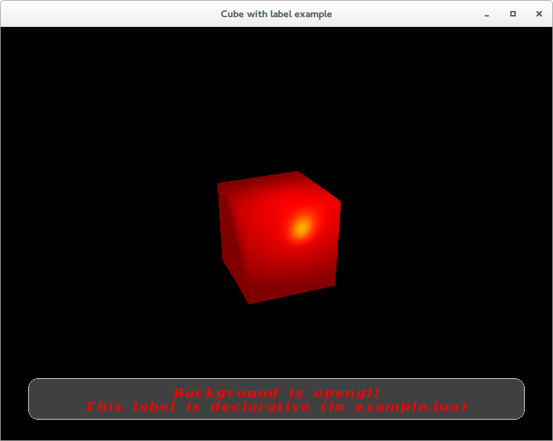

behemoth is graphics engine with lua-based declarative language for designing user interface and 3d stuff.

behemoth - графическй движок с основанным на lua декларативным языком для разработки пользовательского интерфейса и трехмерных сцен.
Спасибо проектам glm, gli, freeglut, lua, freetype.


"Hello world" с использованием движка
 

Интерфейс:

``` lua
ui:rectangle "label"
{
  x = -0.9;
  y = -0.9;
  width = 1.8;
  height = 0.2;
  alpha = 0.5;
  color = glm:vec3(0.5, 0.5, 0.5);
  radius = ui:radius { radius = 0.5; };

  border = ui:border
  {
    color = glm:vec3(0.9, 0.9, 0.9);
    width = 0.02;
  };

  text = ui:text
  {
    alignVerical = "center";
    alignHorizontal = "center";
    text = "Background is opengl!\nThis label is declarative (in example.lua)";
    height = 0.5;
    font = "DejaVuSerifCondensed-BoldItalic";
  };
}; -- rectangle "label"
```
Сцена:
``` lua
s3d:object {
entity = "box.mesh";
-- position = glm:vec3(0.0, 0.0, 0.0);
}
```
Загрузка на С++:
``` cpp
#include "core/application/application.h"
#include "core/application/basicguilayer.h"
#include "core/application/basicscene3dlayer.h"

int main(int argc, char *argv[])
{
    using namespace behemoth;

    CApplication *app = CApplication::getInstance();
    app->initialize(argc, argv);
    app->setWindowTitle("Cube with label example");
    app->setFullScreen(false);
    app->setSize(glm::ivec2(800, 600));
    app->setColorDepth(EColorDepth::_32);

    CBasicGUILayer guiLayer("example_cube_with_label.lua");
    app->setGUILayer(&guiLayer);
    CBasicScene3dLayer sceneLayer("scene_with_box.lua");
    app->setScene3DLayer(&sceneLayer);

    app->exec();

    return 0;
}
```

Больше примеров - [здесь](examples/src/).

Пример сборки:
``` bash
git clone https://github.com/lsyu/behemoth.git
cd behemoth
git submodule init
git submodule update
mkdir build
cd build
cmake ..
make -j 2
```

Генерирование документации (в директории `core/src`)
``` bash
doxygen Doxyfile
```
После выполнения команды сгенерируется документация в директории `core/doc`

---

**Пока что разрабатывается (а потому и тестируется) только на Linux Fedora 20 x86_64 (cmake version 2.8.12.2, gcc version 4.8.2)**
