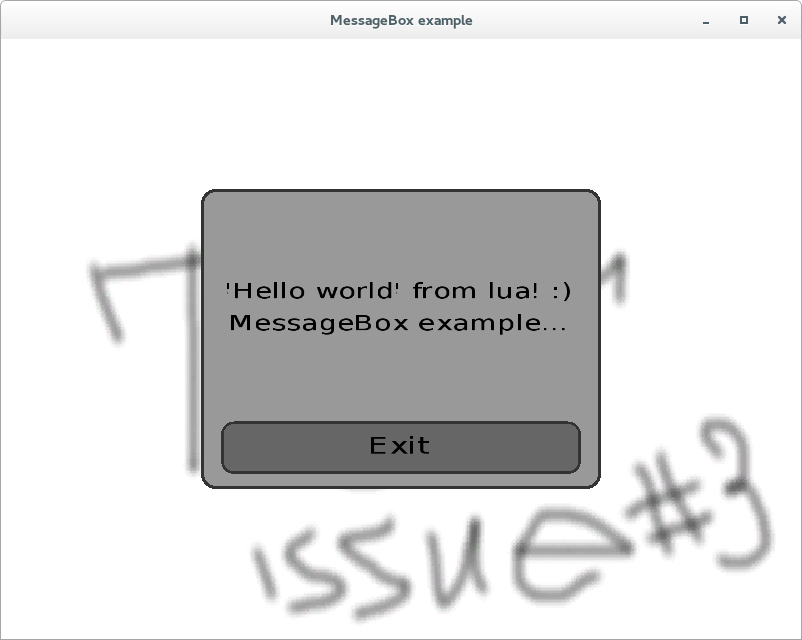

Declarative gui using lua, c++ and opengl.

Заготовка для графического движка с декларативным описанием интерфейса.
Спасибо проектам glm, gli, freeglut, lua, freetype.


Пример реализации messagebox'а в конечном итоге выглядит так:
 


Пример декларативного описания:
``` lua
-- Hello World Lua declarative

ui:rectangle "modal"
{
  x = -0.5;
  y = -0.5;
  width = 1.0;
  height = 1.0;
  radius = 0.1;

  color = ui:vec3(0.6, 0.6, 0.6);

  border = ui:border
  {
    color = ui:vec3(0.2, 0.2, 0.2);
    width = 0.02;
  };

  ui:rectangle "hideItem"
  {
    x = -0.9;
    y = -0.6;
    width = 1.8;
    height = 1.6;
    alpha = 0.0;

    text = ui:text
    {
      alignVerical = "center";
      alignHorizontal = "center";
      text = "'Hello world' from lua! :)\nMessageBox example...";
      height = 0.2;
      font = "DejaVuSans";
    };
  };

  ui:rectangle "button"
  {
    x = -0.9;
    y = -0.9;
    width = 1.8;
    height = 0.35;
    radius = 0.5;

    color = ui:vec3(0.4, 0.4, 0.4);

    border = ui:border
    {
      color = ui:vec3(0.2, 0.2, 0.2);
      width = 0.1;
    };

    text = ui:text
    {
      alignVerical = "center";
      alignHorizontal = "center";
      text = "Exit";
      height = 1;
      font = "DejaVuSans";
    };

    onPressed = function()
      print ("Pressed BUTTON")
    end;

    onClick = function()
      print ("Clicked BUTTON!")
    end;

    onReleased = function()
      print ("Released BUTTON")
    end;
    
  };
};
```

Загрузить этот код на c++ можно [вот так](https://github.com/lsyu/gui/blob/master/labs4physics/src/layers/guilayer.cpp). Подробнее - [тут](https://github.com/lsyu/gui/blob/master/labs4physics/src/)

Пример сборки:
``` bash
git clone https://github.com/lsyu/gui.git
cd gui
git submodule init
git submodule update
mkdir build
cd build
cmake ..
make -j 2
```

Генерирование документации (в директории `core/src`)
``` bash
doxygen Doxyfile
```
После выполнения команды сгенерируется документация в директории `core/doc`

---

**Пока что разрабатывается (а потому и тестируется) только на Linux Fedora 20 (cmake version 2.8.12.2, gcc version 4.8.2)**
